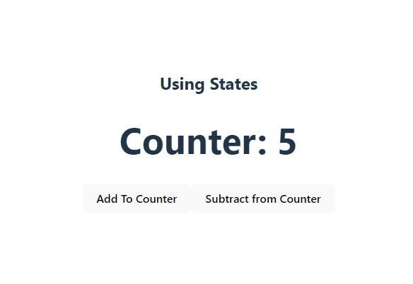

# Table of Contents

1. [What Are States in React](#what-are-states-in-react)
2. [How Does the useState Function Work](#how-does-the-usestate-function-work)
3. [Example](#example)

## What Are States in React

In React, states are special variables that store data relevant to a component. They allow a component to keep track of and manage its data over time. States are used to create dynamic and interactive user interfaces by updating and re-rendering components when the data changes.

## How Does the useState Function Work

The `useState` function is a React Hook used to declare and manage state variables in functional components. It takes an initial state value as its argument and returns an array with two elements:

1. The current state value.
2. A function to update the state.

Here's an example of how `useState` works:

```jsx
import { useState } from "react";

function ExampleComponent() {
  // Declare a state variable 'count' with an initial value of 0
  const [count, setCount] = useState(0);

  // 'count' stores the current state value
  // 'setCount' is a function to update 'count'

  return (
    <>
      <h1>Current Count: {count}</h1>
      <button onClick={() => setCount(count + 1)}>Increment</button>
    </>
  );
}
```

In this example:

- We import `useState` from React.
- Inside the `ExampleComponent`, we declare a state variable `count` using `useState(0)` with an initial value of `0`.
- The `count` variable stores the current state value.
- The `setCount` function is used to update the `count` state variable. We pass the new value we want to set when we click the "Increment" button.

## Example

Here's an example of a React component that uses the `useState` function to manage a counter:

```jsx
import { useState } from "react";

export default function Counter() {
  const [count, setCount] = useState(0);

  const handleCounterAdd = () => {
    setCount(count + 1);
  };

  const handleCounterSubtract = () => {
    setCount(count - 1);
  };

  return (
    <>
      <h1>Counter: {count}</h1>
      <button onClick={handleCounterAdd}>Add To Counter</button>
      <button onClick={handleCounterSubtract}>Subtract from Counter</button>
    </>
  );
}
```



In this code:

- We import `useState` from React.
- The `Counter` component uses the `useState` hook to manage a `count` state variable, which is initially set to `0`.
- Two event handlers, `handleCounterAdd` and `handleCounterSubtract`, update the `count` state variable when the corresponding buttons are clicked.
- The current value of `count` is displayed in the component.
